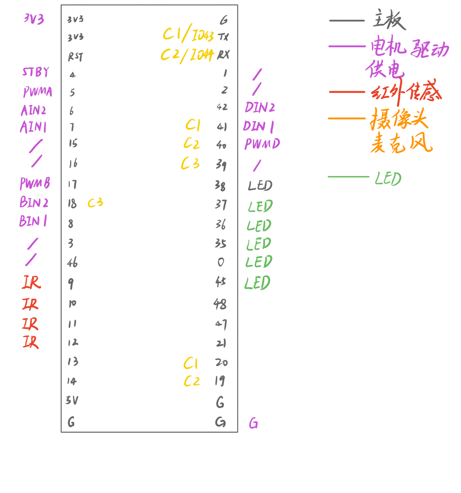

# Line-follower robot

基于 ESP-IDF 的 ESP32-S3 循迹小车项目。

## TODO

- [x] WS2812 灯珠点亮示例（GPIO 38，RMT 驱动）
- [x] 电机可用性测试
- [x] 封装移动相关函数
- [x] 使用 LEDC 完成 PWM 信号的输出
- [x] 确定电机控制相关的引脚
- [ ] 红外传感器调试
- [ ] 循迹移动逻辑
- [ ] LED屏连接与显示测试

## 硬件

- 芯片：ESP32-S3
- 灯珠：WS2812 × 1（GPIO 38）
- 电机驱动：有 TB6612FNG × 2 的驱动板
- 电机 × 3
- 摄像头 × 1
- ...

## 环境

- ESP-IDF v5.4.4
- 依赖：espressif/led_strip ^3.0.3

## 构建

> [!WARNING]
> 在构建与烧录前，务必保证pins.h与实际连接情况一致

当前引脚占用情况


```bash
idf.py build
```

## 烧录

> [!WARNING]
> 在构建与烧录前，务必保证pins.h与实际连接情况一致

（使用USB转串口时）
```bash
idf.py -p COM5 flash
```
